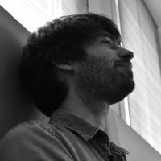

# Welcome

I am currently Associate Professor (Maître de Conférence) at Université de
Rennes, France, in the [EPICURE](https://team.inria.fr/epicure/) research team.
I am primarily interested in the formal verification of safety and security
properties, from low-level binary code to high-level specification.

Before that, I was a postdoc researcher at TU Wien, Austria, in the [Security &
Privacy](https://secpriv.tuwien.ac.at/) research unit, where I worked on the
formal verification of Web browser specification. This projet was founded by
the ERC grant [Foundations and Tools for Client-Side Web
Security](https://cordis.europa.eu/project/id/771527).

I did my PhD thesis entitled [Decision Procedures for Vulnerability
Analysis](https://benjamin.farinier.org/thesis/) at CEA LIST, in the Software
Safety & Security Lab, under the direction of [Marie-Laure
Potet](http://www-verimag.imag.fr/~potet/) and the supervision of [Sébastien
Bardin](http://sebastien.bardin.free.fr/). This work was part of the
[BINSEC](https://binsec.github.io/) project.

* * *

## Contact

- *firstname*.*lastname*@irisa.fr

## Publication

### International Conferences

- [*WebSpec: Towards Machine-Checked Analysis of Browser Security
  Mechanisms*](https://arxiv.org/abs/2201.01649), with Lorenzo Veronese, Pedro
  Bernardo, Mauro Tempesta, Marco Squarcina and Matteo Maffei
- [*Not All Bugs Are Created Equal, But Robust Reachability Can Tell The
  Difference*](https://benjamin.farinier.org/cav2021/), with Guillaume Girol
  and Sébastien Bardin, CAV 2021, Virtual Event
- [*Arrays Made Simpler: An Efficient, Scalable and Thorough
  Preprocessing*](https://benjamin.farinier.org/lpar2018/), with Robin David,
  Sébastien Bardin and Matthieu Lemerre, LPAR 2018, Awassa, Ethiopia
- [*Model Generation for Quantified Formulas: A Taint-Based
  Approach*](https://benjamin.farinier.org/cav2018/), with Sébastien Bardin,
  Richard Bonichon and Marie-Laure Potet, CAV 2018, Oxford, UK

### Invited Talks

- *WebSpec: Towards Machine-Checked Analysis of Browser Security Mechanisms*,
  National Research Days of GT Formal Methods for Security, 2022
- *Decision Procedures for Vulnerability Analysis*, Best Thesis Award GDR GPL
  2020, National Research Days of GDR GPL, 2021
- *Satisfiability Modulo Theories: From Safety to Security*, National Research
  Days of GT Formal Methods for Security, 2019
- *SMT for Binary-Level Security Analysis*, Next Challenges in Constraint
  Solving, Dagstuhl Seminar, 2019

### French Workshops

- *En finir avec les faux positifs grâce à l’exécution symbolique robuste*,
  with Sébastien Bardin, Richard Bonichon and Marie-Laure Potet, JFLA 2019, Les
  Rousses, France.
- *Génération de modèles pour les formules quantifiées : une approche basée sur
  la teinte*, with Sébastien Bardin, Richard Bonichon and Marie-Laure Potet,
  AFADL 2018, Grenoble, France.
- *Simplification efficace pour la théorie des tableaux*, with Robin David and
  Sébastien Bardin, JFLA 2018, Banyuls-sur-Mer, France.
- *Mergeable persistent data structures*, with Thomas Gazagnaire et Anil
  Madhavapeddy, JFLA 2015, Le Val d’Ajol, France

## Teaching

#### 2018 - 2019, at Paris Saclay University
- *Advanced Functional Programming*, Licence 3, 24h
- *Computer Security*, Licence 3, 24h
- *Graph and Logic*, Licence 2, 24h
- *Initiation to Functional Programming*, Licence 2, 18h

#### 2017 - 2018, at Paris Diderot University
- *Database*, Licence 2, 36h
- *Initiation to Java and Python*, Licence 1, 24h

#### 2016 - 2017, at Paris Diderot University
- *Programming Project*, Licence 2, 12h
- *Concepts in Computer Science*, Licence 1, 24h
- *Initiation to Java and Python*, Licence 1, 24h
