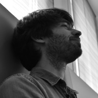

# Welcome

I am currently a postdoc researcher at TU Wien, Austria, in the [Security &
Privacy](https://secpriv.tuwien.ac.at/) research unit. I am primarily
interested in the formal verification of safety and security properties on
Web browser specification. This projet is founded by the ERC grant
[Foundations and Tools for Client-Side Web
Security](https://cordis.europa.eu/project/id/771527).

I did my PhD thesis intitled [Decision Procedures for Vulnerability
Analysis](https://benjamin.farinier.org/thesis/) at CEA LIST, in the Software
Safety & Security Lab, under the direction of [Marie-Laure
Potet](http://www-verimag.imag.fr/~potet/) and the supervision of [Sébastien
Bardin](http://sebastien.bardin.free.fr/). This work was part of the
[BINSEC](https://binsec.github.io/) project.

* * *

## Contact

- *firstname*.*lastname*@tuwien.ac.at

## Publication

### International Conferences

- [*Arrays Made Simpler: An Efficient, Scalable and Thorough
  Preprocessing*](https://benjamin.farinier.org/lpar2018/), with Robin David,
  Sébastien Bardin and Matthieu Lemerre, LPAR 2018, Awassa, Ethiopia
- [*Model Generation for Quantified Formulas: A Taint-Based
  Approach*](https://benjamin.farinier.org/cav2018/), with Sébastien Bardin,
  Richard Bonichon and Marie-Laure Potet, CAV 2018, Oxford, UK

### French Workshops

- *En finir avec les faux positifs grâce à l’exécution symbolique robuste*, with
  Sébastien Bardin, Richard Bonichon and Marie-Laure Potet, JFLA 2019, Les
  Rousses, France.
- *Génération de modèles pour les formules quantifiées : une approche basée sur
  la teinte*, with Sébastien Bardin, Richard Bonichon and Marie-Laure Potet,
  AFADL 2018, Grenoble, France.
- *Simplification efficace pour la théorie des tableaux*, with Robin David and
  Sébastien Bardin, JFLA 2018, Banyuls-sur-Mer, France.

### Talks

- *Workshop on Formal Methods for Security*, March 2019, Paris, France.
- *Next Challenges in Constraint Solving*, February 2019, Dagstuhl, Germany.
- *Model Generation for Quantified Formulas*, May 2018, LSL seminar, Paris,
  France.
- *Efficient Simplification for the Array Theory*, April 2018, ANR Soprano
  meeting, Paris, France.
- *Model Generation for Quantified Formulas*, Mars 2018, Verimag seminar,
  Grenoble, France.

## Teaching

#### 2018 - 2019, at Paris Saclay University
- *Advanced Functional Programming*, Licence 3, 24h
- *Computer Security*, Licence 3, 24h
- *Graph and Logic*, Licence 2, 24h
- *Initiation to Functional Programming*, Licence 2, 18h

#### 2017 - 2018, at Paris Diderot University
- *Database*, Licence 2, 36h
- *Initiation to Java and Python*, Licence 1, 24h

#### 2016 - 2017, at Paris Diderot University
- *Programming Project*, Licence 2, 12h
- *Concepts in Computer Science*, Licence 1, 24h
- *Initiation to Java and Python*, Licence 1, 24h
